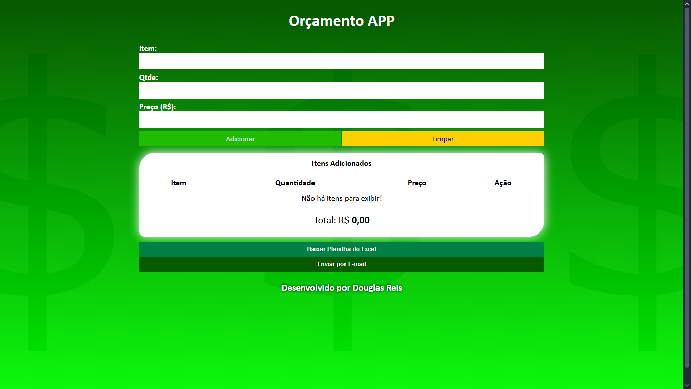
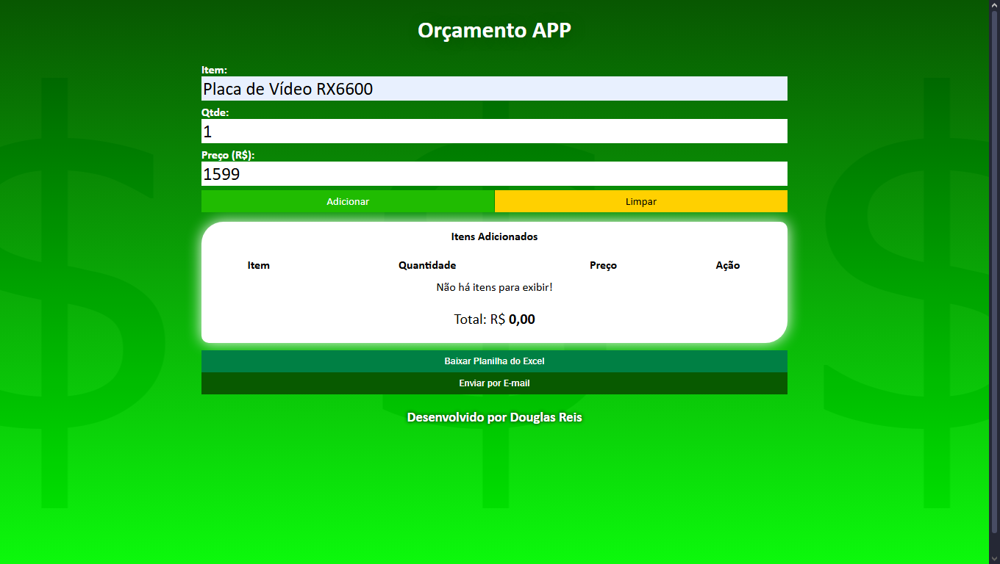
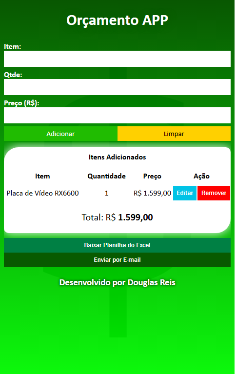
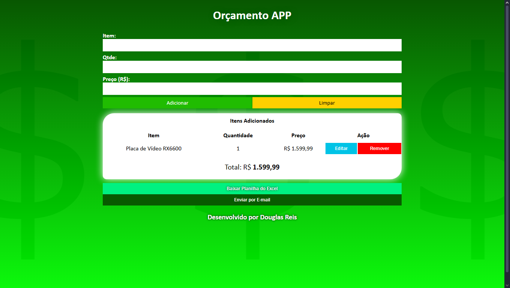
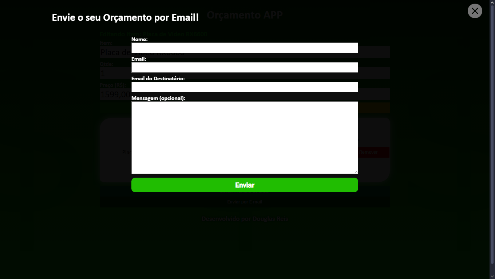
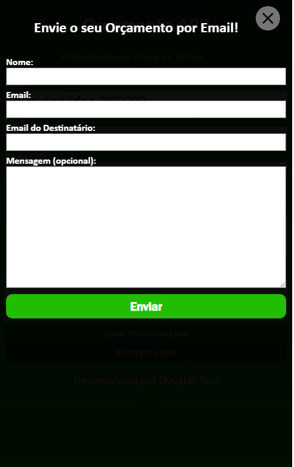

# Orçamento - App

## Aplicativo para a Criação de Orçamentos

 

Status: Concluído

 

Pré-requisito: Navegador atualizado

 

## Sumário

- [Sobre](#Sobre)
- [Como Usar](#Como-Usar)
- [Linguagens e Recursos Usados](#inguagens-e-Recursos-Usados)
- [Links](#Links)
- [Autor](#Autor)

## Sobre

Projeto de aplicação para criação de orçamentos onde é possível baixá-los como um arquivo do Excel e também enviá-lo por e-mail.

### Desktop  

### Mobile  

## Como Usar

Ao carregar a tela inicial da aplicação, insira o Nome, Quantidade e Preço do Item

### Desktop  

### Mobile  

O item adicionado será incluído na tabela de Itens adicionados.

### Desktop  

### Mobile  

<b>OBS.: O preço será multiplicado à quantidade!</b>

É possível adicionar quantos itens forem necessários.

Os itens do orçamento são armazenados no Armazenamento Local (localStorage) do navegador (browser).

Ao clicar no botão "Baixar Planilha do Excel", é baixado um arquivo XLSX com os itens cadastrados.

É possível também enviar este mesmo arquivo por e-mail.

### Desktop  

### Mobile  

Para enviar o arquivo XLSX por e-mail, clique em "Enviar por E-mail". Ao abrir a janela modal, insira o Nome, Email, Email de Destinatário e uma Mensagem (opcional), e então clicar em "Enviar".

Ao aparecer a mensagem "E-mail enviado com sucesso!", a mensagem foi enviada!

<b>OBS.: A mensagem pode cair na caixa de Spam do destinatário!</b>

## Linguagens e Recursos Usados
- JavaScript
- ReactJS
- CSS3
- Node.js
- Express.js

## Links

- URL do Projeto: [Clique aqui](https://github.com/DouglasReis98/OrcamentoAPP-ReactJS)
- URL da Página: [Clique aqui](https://orcamentoapp.vercel.app)

## Autor
- Website - [Douglas Reis](https://douglasreis.vercel.app)
- LinkedIn - [@douglas-reis98](https://www.linkedin.com/in/douglas-reis98/)